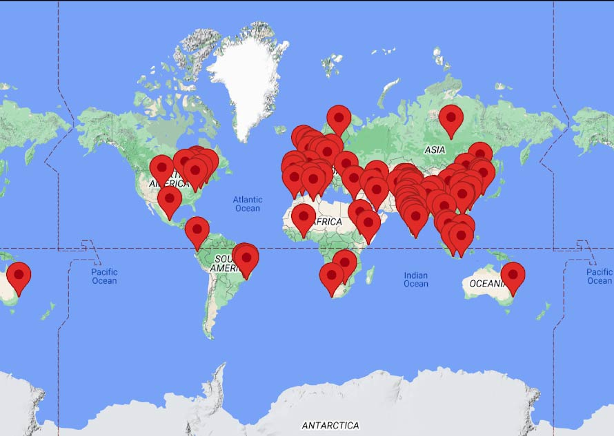

# Belfin Robinson

## About Me
Hello! I'm Belfin, a seasoned Computer Scientist with over 12 years of experience specializing in Data Analytics, Neuroinformatics, Network Neuroscience, and AI-driven innovations. I am passionate about using advanced algorithms and models to address complex challenges across technology and various domains.

📞 **Contact:** 336.264.0909  
📧 **Email:** [researchbelfin@gmail.com](mailto:researchbelfin@gmail.com)  
🌍 **Location:** Chapel Hill, NC  
🔗 [**LinkedIn**](https://linkedin.com/in/belfin)  
🔗 [**GitHub**](https://github.com/belfinrv)  
🔗 [**Google Scholar**](https://scholar.google.com/citations?user=hXKhuLYAAAAJ&hl=en&authuser=1)  

## Technical Skills
**Current:**
- **Programming Languages:** Python (NumPy, Pandas, Matplotlib, TensorFlow, Keras), R, MATLAB
- **Frameworks and Libraries:** SciPy, networkX, pytorch, NLTK, igraph, muxviz, multinet
- **Technologies:** Unix scripting, SLURM, Oracle PL/SQL, Power BI, Azure, MLOPs, DevOps
- **AI Models:** Multimodal Deep Learning Models in Computer Vision and Time Series data, Large Language Models (LLMs) including Transformers, GPT, BERT, and applications using Hugging Face, LangChain.

**Proficient:**
- **Programming Languages:** Java, JavaScript, C#
- **Databases:** Oracle 12C, Neo4J, Microsoft SQL Server
- **Tools:** Google API's, Tableau, Big Query, GIT

## AI Projects
### University of North Carolina | Sr. Computer Scientist
**March 2022 – Present, Chapel Hill, NC, USA**
- [Alzheimer’s Biomarker Diagnostic System](#)
  - **Role:** Design, Development, Lead
  - **Key Areas:** PET Scans, Statistical Analysis, Multilayer Network Science
- [Chronic Pain Diagnostic Models](#)
  - **Role:** Design, Development, Mentoring
  - **Key Areas:** fMRI time series images, Computer Vision,  ML models, Hyper Parameter Tuning, DL Models, Signal Processing
- [Epilepsy brain components classifier](#)
  - **Role:** Design, Development, Lead
  - **Key Areas:** fMRI time series images, Computer Vision,  ML models, DL Models, Hybrid(Multimodel), Signal Processing
- [Report Generator RAG LLM Model (Physician Draft Report After Image Classification)](#)
  - **Role:** Design, Development, Lead
  - **Key Areas:** fMRI Time Series Images, Computer Vision, RAG, Med-PaLM, Hybrid (Multimodal), Signal Processing
- [Overlapping Community Detection (4S Algorithm)](#)
  - Innovated social network algorithms enhancing seed selection and community detection, referred by global researchers.

- [Covid'19 peak estimation (Predictive model)](#)
  - Developed a COVID-19 Peak Prediction algorithm and a Graph-based Chatbot for Cancer patients, significantly aiding in pandemic response and patient care.

- Led major Oracle R12 upgrades and implementations, improving system efficiency and user experience across various modules.
  
## Work Experiances
-  **University of North Carolina | Sr. Computer Scientist | March 2022 – Present, Chapel Hill, NC, USA**
-  **Karunya University | Computer Scientist/ Professor | July 2013 – March 2022, India**
-  **Wipro Technologies | Software Engineer (Oracle EBS/ERP Consultant) | January 2011 – July 2013, India**
-  **Robert Bosch | Software Engineer ( C# Application Developer) | December 2008 - April 2009**

## Education
- **Ph.D. in Computer Science (Graph Analytics)**, Karunya University, India, May 2020
- **Master’s in Computer Science Engineering**, Anna University, India, May 2011
- **Bachelor’s in Computer Science Engineering**, Karunya University, India, April 2009

## Research impact across globe

## Top Conferences

## Invited Talks

## Certifications
- **fMRI I** - [Johns Hopkins University, USA, 2022](https://www.coursera.org/account/accomplishments/verify/TBMYM5K6LFP2)
- **fMRI II** - [Johns Hopkins University, USA, 2022](https://www.coursera.org/account/accomplishments/verify/TBMYM5K6LFP2)
- **Synapses, Neurons, and Brains** - [The Hebrew University of Jerusalem, Israel, 2020](https://www.coursera.org/account/accomplishments/records/PG8DN2AY6PG8)
- **Introduction to Neuro-hacking In R** - [Johns Hopkins University, USA, 2020](https://www.coursera.org/account/accomplishments/verify/XVUM9KYJGG6E)
- **Fundamental Neuroscience for Neuroimaging** - [Johns Hopkins University, USA, 2022](https://www.coursera.org/account/accomplishments/verify/P3AMPDXF28QM)
- **Oracle Certified Professional Java SE 6** - [Oracle India, 2013](eCertificate.pdf)

## Awards

